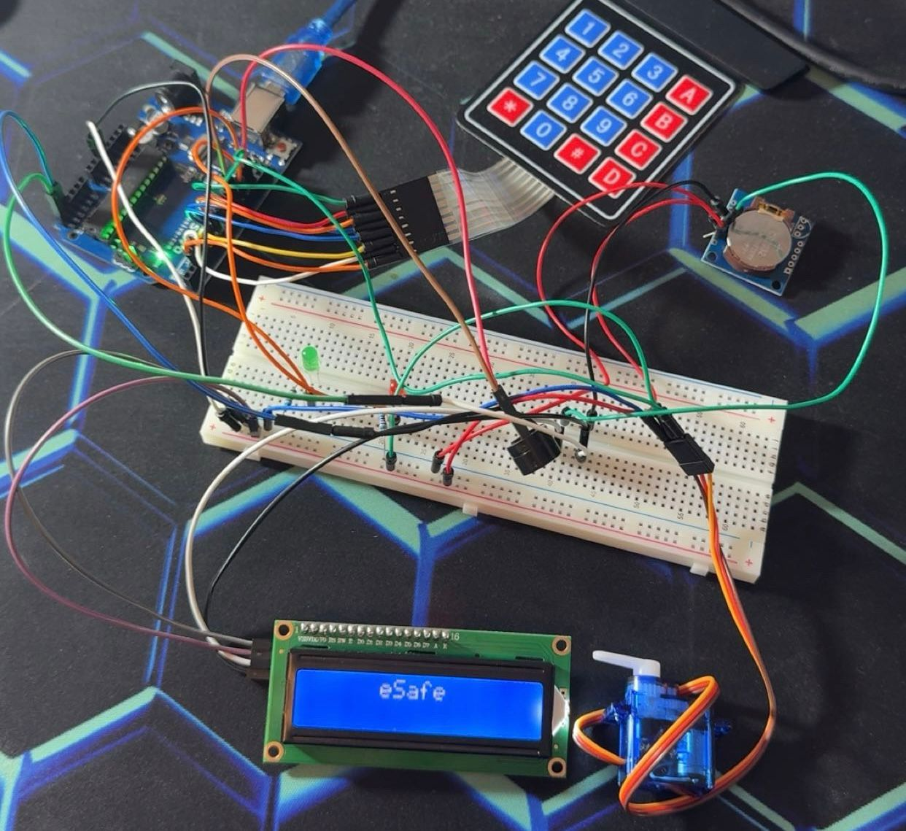
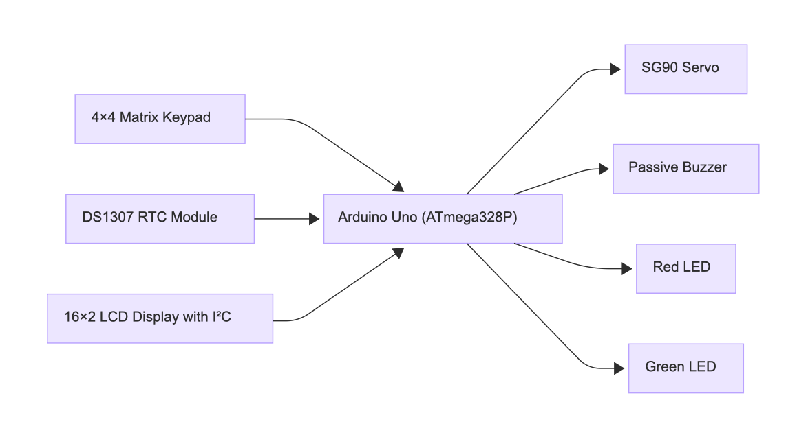
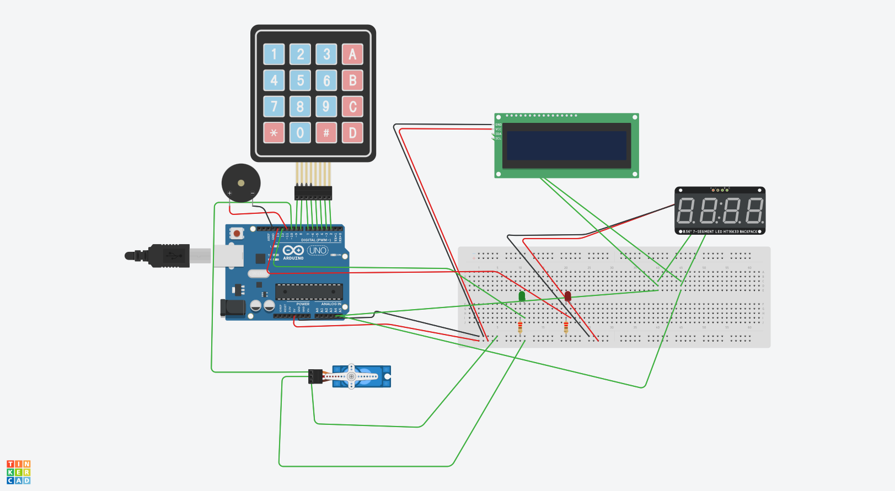
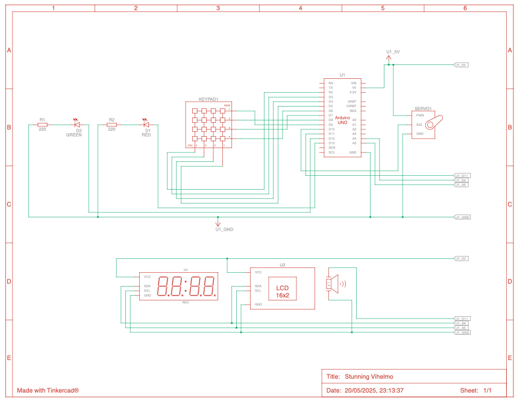

# eSafe  

**Digital Lockbox with Arduino Uno**
A DIY electronic safe that brings together multiple embedded-systems concepts into one project:

- **4×4 matrix keypad** for secure 4-digit PIN entry  
- **SG90 servo** drives a latch (locked ↔ unlocked angles)  
- **Passive buzzer** & **red/green LEDs** for alarm and status feedback  
- **DS1307 RTC** + **16×2 I²C LCD** enforce business-hour access windows and log the last unlock time  
- **Time-lock feature** prevents unlocking outside a configurable window  
- **Three-strike alarm**: after 3 wrong PINs you get 5 s of buzzer + flashing red LED  

## Hardware Schematics

### Block Diagram

### Wiring Schematic (Part 1)

### Wiring Schematic (Part 2)

## Key Technical Highlights  
- **Non-blocking relock** via `millis()`: the 5 s unlock interval never freezes the clock display  
- **Persistent last-unlock display**: “Last HH:MM” stays visible even while entering a new PIN  
- **GPIO & pin-change interrupts** for truly responsive keypad scanning  
- **Timer 2 CTC** for keypad debounce (display update moved to a `millis()` timer)  
- **PWM** via the Arduino Servo library for precise latch positioning  
- **I²C/TWI bus sharing** between RTC and LCD on A4/A5  

For full schematics, bill of materials, code structure and docs, see the OCW project page:  
<https://ocw.cs.pub.ro/courses/pm/prj2025/eradu/stefan.dascalu2612>
